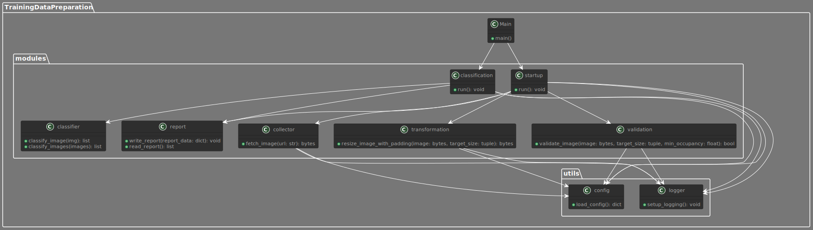

# Training Data Preparation

---

**Training Data Preparation** é uma ferramenta essencial para a preparação de dados de treinamento para modelos de aprendizado de máquina, construída com Python. Automatize a coleta, transformação e classificação de dados para otimizar o treinamento de seus modelos.

⚠️ Este projeto é complementado pelo projeto [🔗 Fashion Image Analyzer](https://github.com/fabiobraganet/fashion-image-analyzer)

---

## Índice

1. [🚀 Funcionalidades](#-funcionalidades)
2. [📦 Instalação](#-instalação)
   - [Pré-requisitos](#pré-requisitos)
   - [Passos](#passos)
3. [🔧 Configuração](#-configuração)
   - [Parâmetros de Execução](#parâmetros-de-execução)
4. [🛠️ Uso](#️-uso)
   - [Comandos Básicos](#comandos-básicos)
5. [📁 Armazenamento de Dados](#-armazenamento-de-dados)
   - [Formatos de Saída](#formatos-de-saída)
6. [💡 Boas Práticas](#-boas-práticas)
7. [🤝 Contribuições](#-contribuições)
8. [📊 Visão Geral Executiva](#visão-geral-executiva)
    - [O que é o Training Data Preparation?](#o-que-é-o-training-data-preparation)
    - [Principais Funcionalidades](#principais-funcionalidades)
    - [Casos de Uso](#casos-de-uso)
    - [Benefícios para a Empresa](#benefícios-para-a-empresa)
9. [🔍 Visão Geral Técnica](#visão-geral-técnica)
    - [Arquitetura e Tecnologias Utilizadas](#arquitetura-e-tecnologias-utilizadas)
    - [Componentes Principais](#componentes-principais)
    - [Fluxo de Operação](#fluxo-de-operação)
    - [Destaques Técnicos](#destaques-técnicos)
10. [📘 Manual de Uso do Training Data Preparation](#manual-de-uso-do-training-data-preparation)
    - [Introdução](#introdução)
    - [Instalação](#instalação)
      - [Pré-requisitos](#pré-requisitos-1)
      - [Passos de Instalação](#passos-de-instalação)
    - [Configuração](#configuração-1)
      - [Configuração dos Parâmetros](#configuração-dos-parâmetros)
    - [Uso](#uso-1)
      - [Comandos Básicos](#comandos-básicos-1)
      - [Exemplos de Uso](#exemplos-de-uso)
    - [Armazenamento de Dados](#armazenamento-de-dados-1)
      - [Formatos de Saída](#formatos-de-saída-1)
      - [Exemplo de Arquivo JSON](#exemplo-de-arquivo-json)
    - [Boas Práticas](#boas-práticas-1)
    - [Suporte e Contribuição](#suporte-e-contribuição)
11. [📄 Licença](#-licença)
12. [📞 Suporte](#-suporte)

---

## 🚀 Funcionalidades

- **Coleta de Dados**: Baixe imagens de URLs fornecidas e valide a qualidade das mesmas.
- **Transformação de Imagens**: Redimensione e ajuste imagens para padrões específicos de treinamento.
- **Classificação Inicial**: Classifique imagens em categorias iniciais usando modelos pré-treinados.
- **Armazenamento Estruturado**: Organize e salve imagens e metadados em estruturas de diretórios apropriadas.
- **Relatórios Detalhados**: Gere relatórios detalhados das operações de coleta, transformação e classificação.

---

## 📦 Instalação

### Pré-requisitos

- [Python 3.9](https://www.python.org/downloads/release/python-390/)
- [Pip](https://pip.pypa.io/en/stable/installation/)

### Passos

1. **Clone o Repositório:**
   """
   git clone https://github.com/seu-usuario/TrainingDataPreparation.git
   cd TrainingDataPreparation
   """

2. **Crie um Ambiente Virtual:**
   """
   python -m venv venv
   source venv/bin/activate  # No Windows use `venv\Scripts\activate`
   """

3. **Instale as Dependências:**
   """
   pip install -r requirements.txt
   """

---

## 🔧 Configuração

### Parâmetros de Execução

- `jsonl_path`: Caminho para o arquivo JSONL contendo as URLs das imagens.
- `output_path`: Caminho para o arquivo de saída JSONL com as classificações.

---

## 🛠️ Uso

### Comandos Básicos

1. **Executar a Preparação de Dados:**
   """
   python src/main.py --jsonl_path=data/images.jsonl --output_path=data/output.jsonl
   """

---

## 📁 Armazenamento de Dados

**Formatos de Saída:**

- **JSON:**

  """
  [
      {
          "md5": "d41d8cd98f00b204e9800998ecf8427e",
          "classes": [
              {"class_id": "n123456", "class_name": "dress", "score": 0.95},
              {"class_id": "n654321", "class_name": "skirt", "score": 0.05}
          ]
      },
      {
          "md5": "d41d8cd98f00b204e9800998ecf8427e",
          "classes": [
              {"class_id": "n123456", "class_name": "dress", "score": 0.85},
              {"class_id": "n654321", "class_name": "skirt", "score": 0.15}
          ]
      }
  ]
  """

---

## 💡 Boas Práticas

1. **Verificar o Formato dos Dados:** Certifique-se de que as URLs das imagens estejam no formato correto.
2. **Gerenciar Dependências:** Utilize um ambiente virtual para isolar as dependências do projeto.
3. **Usar de Forma Ética:** Respeite as leis de direitos autorais e privacidade ao baixar e processar imagens.

---

## 🤝 Contribuições

Contribuições são bem-vindas! Siga os passos abaixo para contribuir:

1. Faça um fork do projeto.
2. Crie uma nova branch para sua feature ou correção: 

    """
    git checkout -b minha-feature
    """
3. Commit suas mudanças: 

    """
    git commit -m 'Adiciona minha nova feature'
    """
4. Faça push para a branch: 

    """
    git push origin minha-feature
    """
5. Envie um pull request.

---

## 📊 Visão Geral Executiva

***O que é o Training Data Preparation?***

O Training Data Preparation é uma ferramenta avançada para a preparação de dados de treinamento, projetada para coletar, transformar e classificar imagens de forma eficiente e automatizada. Este software é capaz de capturar dados de imagens, aplicar validações, transformar as imagens e classificá-las em diferentes categorias usando modelos pré-treinados.

### **Principais Funcionalidades**

**Coleta de Dados:**

Baixe imagens de URLs fornecidas no arquivo JSONL e valide a qualidade e a conformidade das imagens.

**Transformação de Imagens:**

Redimensione e ajuste as imagens para padrões específicos necessários para o treinamento de modelos de aprendizado profundo.

**Classificação Inicial:**

Utilize modelos pré-treinados para uma classificação inicial das imagens, organizando-as em categorias iniciais.

**Armazenamento Estruturado:**

Salve as imagens transformadas e classificadas em uma estrutura de diretórios organizada, facilitando o uso posterior nos processos de treinamento.

### Casos de Uso

**Preparação de Dados para Treinamento de Modelos:**

Utilize o Training Data Preparation para preparar grandes volumes de dados de imagem de forma eficiente, garantindo a qualidade e a conformidade dos dados para treinamento de modelos.

**Análise e Curadoria de Imagens:**

Empresas podem usar a ferramenta para coletar, transformar e classificar imagens, facilitando a análise e curadoria de grandes volumes de dados visuais.

### Benefícios para a Empresa

**Qualidade e Conformidade dos Dados:**

Garanta que os dados utilizados para o treinamento de modelos estejam em conformidade com os padrões necessários, melhorando a qualidade e a precisão dos modelos.

**Automação e Eficiência:**

Automatize o processo de preparação de dados, reduzindo a necessidade de intervenções manuais e economizando tempo e recursos.

**Escalabilidade:**

Com a capacidade de processar grandes volumes de dados de imagem, o Training Data Preparation pode ser escalado para atender a diversas necessidades de negócios.

---

## 🔍 Visão Geral Técnica

### Arquitetura e Tecnologias Utilizadas

**TrainingDataPreparation** é um projeto Python para a preparação de dados de treinamento, coletando, validando, transformando e classificando imagens de moda. Utiliza TensorFlow para classificação de imagens e armazena os resultados em formato JSON. O projeto é organizado em componentes modulares, seguindo princípios de SOLID e Clean Code para garantir manutenibilidade e escalabilidade.

### Explicação do UML

O diagrama UML mostra a estrutura e as relações entre os componentes do projeto "TrainingDataPreparation". O projeto é organizado em dois pacotes principais: `modules` e `utils`, com uma classe `Main` que inicia o processo.

#### Pacote `modules`

1. **classification**
    - **Método**: `run()`
    - **Descrição**: Este módulo gerencia a classificação das imagens. Ele coordena o processo de classificação chamando métodos de outros módulos.

2. **classifier**
    - **Métodos**:
        - `classify_image(img): list`
        - `classify_images(images): list`
    - **Descrição**: Este módulo utiliza um modelo pré-treinado (MobileNetV2) para classificar as imagens. Ele fornece funções para classificar uma única imagem ou uma lista de imagens.

3. **collector**
    - **Método**: `fetch_image(url: str): bytes`
    - **Descrição**: Este módulo é responsável por buscar as imagens a partir das URLs fornecidas. Ele faz uma solicitação HTTP para obter o binário da imagem.

4. **report**
    - **Métodos**:
        - `write_report(report_data: dict): void`
        - `read_report(): list`
    - **Descrição**: Este módulo gerencia a criação e leitura de relatórios. Ele registra informações detalhadas sobre o processo de coleta, transformação e classificação das imagens.

5. **startup**
    - **Método**: `run()`
    - **Descrição**: Este módulo inicia o processo de preparação dos dados de treinamento. Ele lê o arquivo JSONL de entrada, coordena a coleta, validação, transformação e classificação das imagens.

6. **transformation**
    - **Método**: `resize_image_with_padding(image: bytes, target_size: tuple): bytes`
    - **Descrição**: Este módulo realiza a transformação das imagens, ajustando-as para um tamanho específico com padding, se necessário, para manter as proporções.

7. **validation**
    - **Método**: `validate_image(image: bytes, target_size: tuple, min_occupancy: float): bool`
    - **Descrição**: Este módulo valida as imagens com base nas regras definidas, como a proporção mínima de ocupação. Ele garante que apenas as imagens que atendem aos critérios são processadas.

#### Pacote `utils`

1. **config**
    - **Método**: `load_config(): dict`
    - **Descrição**: Este módulo carrega as configurações do projeto. Ele fornece as configurações necessárias para outros módulos.

2. **logger**
    - **Método**: `setup_logging(): void`
    - **Descrição**: Este módulo configura o sistema de logging do projeto. Ele é usado para registrar informações e erros durante a execução do projeto.

#### Classe `Main`

- **Método**: `main()`
- **Descrição**: Esta classe é o ponto de entrada do projeto. Ela configura o logging e inicia os módulos `startup` e `classification`.

#### Relações Entre as Classes

1. **Main**
    - Usa `startup` e `classification` para iniciar o processo.

2. **startup**
    - Chama `collector`, `validation`, `transformation` e `report` para coordenar o processo de preparação das imagens.

3. **classification**
    - Chama `classifier` para classificar as imagens.
    - Usa `report` para registrar os resultados.

4. **collector**
    - Usa `config` para carregar configurações.
    - Usa `logger` para registrar informações e erros.

5. **transformation**
    - Usa `config` para carregar configurações.
    - Usa `logger` para registrar informações e erros.

6. **validation**
    - Usa `config` para carregar configurações.
    - Usa `logger` para registrar informações e erros.

7. **classification**
    - Usa `config` para carregar configurações.
    - Usa `logger` para registrar informações e erros.

8. **startup**
    - Usa `config` para carregar configurações.
    - Usa `logger` para registrar informações e erros.

    >Essa estrutura modular e bem organizada permite uma fácil manutenção e extensibilidade do projeto. Cada módulo tem uma responsabilidade clara e pode ser testado e modificado independentemente.

.

**Python 3.9:**

Linguagem de programação de alto nível usada para construir a aplicação.

**TensorFlow:**

Biblioteca de aprendizado profundo usada para classificar as imagens.

**Pandas:**

Utilizado para manipulação de dados e armazenamento dos resultados em diferentes formatos.

### Componentes Principais

**Coletor:**

Responsável por baixar as imagens das URLs fornecidas no arquivo JSONL.

**Validador:**

Valida a conformidade e a qualidade das imagens baixadas.

**Transformador:**

Transforma as imagens conforme os padrões necessários para o treinamento de modelos.

**Classificador:**

Classifica as imagens usando modelos pré-treinados.

### Fluxo de Operação

1. O usuário fornece um arquivo JSONL com as URLs das imagens.
2. O Coletor baixa as imagens.
3. O Validador verifica a conformidade das imagens.
4. O Transformador ajusta as imagens.
5. O Classificador categoriza as imagens.
6. Os resultados são armazenados em um arquivo JSON.

### Destaques Técnicos

- Utilização de modelos pré-treinados do TensorFlow para classificação de imagens.
- Validação e transformação eficiente de imagens.
- Armazenamento flexível dos resultados em formato JSON.

---

## 📘 Manual de Uso do Training Data Preparation

### Introdução

O Training Data Preparation é uma ferramenta projetada para facilitar a preparação de dados de treinamento para modelos de aprendizado de máquina, coletando, transformando e classificando imagens de forma eficiente.

### Instalação

#### Pré-requisitos

- Python 3.9
- Pip

#### Passos de Instalação

1. Clone o repositório.
2. Crie um ambiente virtual.
3. Instale as dependências.

### Configuração

#### Configuração dos Parâmetros

- Caminho para o arquivo JSONL com as URLs das imagens.
- Caminho para o arquivo de saída JSONL com as classificações.

### Uso

#### Comandos Básicos

1. Execute a preparação de dados com o comando:

   """
   python src/main.py --jsonl_path=data/images.jsonl --output_path=data/output.jsonl
   """

### Armazenamento de Dados

#### Formatos de Saída

- JSON

#### Exemplo de Arquivo JSON

1. Arquivo Json

    """
    [
        {
            "md5": "d41d8cd98f00b204e9800998ecf8427e",
            "classes": [
                {"class_id": "n123456", "class_name": "dress", "score": 0.95},
                {"class_id": "n654321", "class_name": "skirt", "score": 0.05}
            ]
        }
    ]
    """

---

## 💡 Mais Boas Práticas

- Verifique o formato dos dados.
- Utilize um ambiente virtual para isolar as dependências do projeto.
- Respeite as leis de direitos autorais e privacidade ao baixar e processar imagens.

---

### Suporte e Contribuição

Para suporte adicional, abra uma issue no repositório ou entre em contato com os mantenedores.

---

## 📄 Licença

Este projeto está licenciado sob a licença MIT - veja o arquivo [LICENSE](LICENSE) para mais detalhes.

---

## 📞 Suporte

Para suporte adicional, abra uma issue no repositório ou entre em contato com os mantenedores.

---
